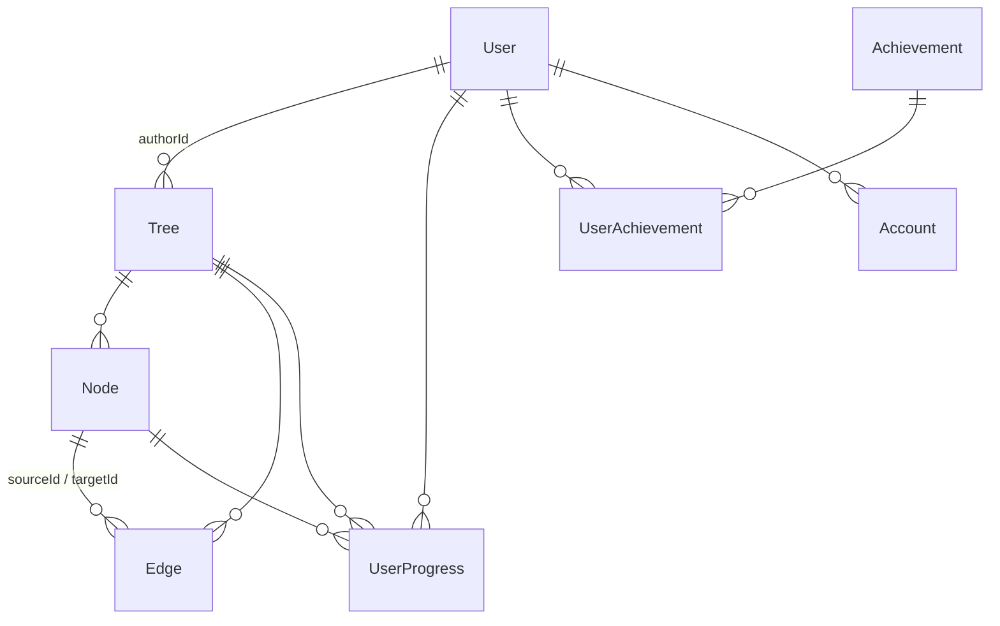

# Архитектура SkilLet

Краткое описание устройства проекта — для следующего разработчика/агента.
Стек: Next.js 15 (App Router) · React 19 · TypeScript · Prisma + PostgreSQL ·
NextAuth v5 (GitHub OAuth) · @xyflow/react · Tailwind CSS 4 · zod · vitest.

---

## Структура проекта (Feature-Sliced Design)

```
src/
├── app/                    # слой app: маршруты и точки входа
│   ├── api/                #   REST API-роуты (route handlers)
│   ├── dashboard|explore|profile|tree/  #   страницы
│   └── layout.tsx, providers.tsx, error/loading/not-found
├── entities/               # сущности домена
│   ├── node/               #   модель (types, zod-схемы, nodeHelpers), ui (SkillNode)
│   ├── tree/               #   модель (types, schemas), ui (TreeCard)
│   └── user/               #   типы
├── features/               # пользовательские сценарии
│   ├── achievements/       #   сервис достижений (checkAndGrantAchievements)
│   ├── auth/               #   AuthButton, useAuth
│   ├── progress-tracker/   #   MarkCompleteButton
│   └── tree-builder/       #   редактор дерева (useTreeEditor, TreeEditor)
├── widgets/                # крупные композиции
│   ├── SkillTreePage/      #   страница дерева (просмотр/редактор/прогресс)
│   ├── SkillTreeViewer/    #   ReactFlow-просмотр графа
│   ├── ProgressSidebar/    #   сайдбар прогресса
│   └── Header/
├── shared/
│   ├── lib/                # инфраструктура: prisma (singleton), auth (NextAuth),
│   │                       # logger (JSON-логи), errorTracking (Sentry-транспорт),
│   │                       # rateLimit (интерфейс + in-memory adapter),
│   │                       # dag (валидация DAG), api (parseJsonBody), requestId
│   ├── constants/          # статусы узлов, шаблоны, лимиты
│   └── ui/                 # Button, Modal, Toast, EmptyState и т.п.
├── middleware.ts           # генерация X-Request-Id для каждого запроса
└── instrumentation.ts      # register(): graceful shutdown (SIGTERM → prisma.$disconnect)
tests → src/tests/          # интеграционные тесты API (helpers, setup, globalSetup)
prisma/                     # schema.prisma, migrations/, seed.ts
```

Зависимости направлены строго вниз: `app → widgets → features → entities → shared`.

---

## Модель данных



Ключевые ограничения целостности:

- `Edge @@unique([sourceId, targetId])` — дубликаты рёбер невозможны на уровне БД;
- DAG-инвариант (ацикличность) — при создании ребра `validateEdge` + вставка в одной
  Serializable-транзакции (гонка двух параллельных рёбер не может создать цикл);
- `UserProgress @@unique([userId, nodeId])`; все связи — `onDelete: Cascade`;
- индексы под реальные запросы: `Tree(isPublic, createdAt DESC)` — сортировка
  каталога, `UserProgress(userId, completed)` — подсчёт streak/статистики,
  `UserProgress(userId, treeId)` — прогресс по конкретному дереву.

---

## Поток авторизации

NextAuth v5 (`src/shared/lib/auth.ts`) + GitHub OAuth + PrismaAdapter:

1. Вход: браузер → `/api/auth/signin/github` → GitHub (state-флоу, встроенный CSRF) →
   callback → PrismaAdapter создаёт/связывает `User` + `Account`.
2. Стратегия сессии — **JWT** (задана явно): `jwt`-колбэк кладёт `user.id` в токен,
   `session`-колбэк прокидывает его в `session.user.id`. Валидация сессии не требует
   запроса к БД; cookie `SameSite=Lax` (см. CSRF в DEPLOYMENT.md).
3. Каждый API-роут вызывает `auth()` и проверяет `session?.user?.id` → 401;
   владение ресурсом проверяется scoped-запросами (`authorId` в WHERE).

### Таблица аудита авторизации (эндпоинт → кто может вызвать → что проверяется)

| Эндпоинт | Кто | Проверки |
|---|---|---|
| `GET /api/trees?scope=public` | все | пагинация/лимиты; Cache-Control public+s-maxage=30 |
| `GET /api/trees?scope=mine` | владелец сессии | 401 без сессии; фильтр `authorId = session.user.id` |
| `POST /api/trees` | авторизованный | 401; rate limit `treeCreate`; zod-валидация |
| `GET /api/trees/[id]` | владелец или все для публичного | 404 если нет; 403 если приватное и не владелец |
| `PATCH /api/trees/[id]` | только владелец | 401; zod; scoped `update({ where: { id, authorId } })` → 404 для чужого |
| `DELETE /api/trees/[id]` | только владелец | 401; scoped `delete({ where: { id, authorId } })` → 404 (не раскрывает существование) |
| `POST /api/trees/[id]/nodes` | только владелец дерева | 401; guard владельца; rate limit; лимит MAX_NODES_PER_TREE |
| `PATCH/DELETE .../nodes/[nodeId]` | только владелец дерева | 401; guard + scoped WHERE `{ id, treeId, tree: { authorId } }` |
| `POST /api/trees/[id]/edges` | только владелец дерева | 401; guard; rate limit; DAG-валидация в Serializable-транзакции (цикл → 400, дубликат → 400/unique, гонка → retry/409) |
| `DELETE .../edges/[edgeId]` | только владелец дерева | 401; guard + scoped WHERE |
| `POST /api/trees/[id]/progress` | владелец или читатели публичного дерева | 401; treeId только из URL (не из body); streak/достижения — только своей сессии |
| `POST /api/trees/from-template` | авторизованный | 401; rate limit `treeTemplate`; связи шаблона фильтруются DAG-инвариантом |
| `POST /api/ai/generate` | авторизованный | 401; rate limit `aiGenerate`; zod; фильтрация циклов в ответе LLM |
| `GET /api/profile` | владелец сессии | 401; только свои данные |
| `GET /api/health` | все | без авторизации (для мониторинга); не раскрывает внутренностей |
| `/api/auth/*` | все | NextAuth v5: встроенный CSRF + state OAuth |

Расхождений «задумано vs реализовано» по итогам аудита не найдено; попутно
устранены TOCTOU-окна «найти → проверить → изменить» (все мутации ownership
теперь одним scoped-запросом) и гонка создания рёбер (Serializable-транзакция).

---

## Поток запроса (наблюдаемость)

```
клиент → middleware.ts (X-Request-Id: сгенерирован или проксирован)
       → route handler: getRequestId(request) → auth() → проверки
       → логи: logApiError / logApiInfo / logEvent (JSON с requestId, userId, route)
       → ошибка → captureException() → Sentry (если задан SENTRY_DSN)
       → ответ с X-Request-Id
```

Бизнес-события для аналитики: `tree_created`, `ai_tree_generated`,
`progress_marked`, `achievement_unlocked` (`type: 'business_event'`).

---

## Архитектурные компромиссы (осознанные «достаточно хорошо для текущего масштаба»)

| # | Компромисс | Почему ок сейчас | Триггер к переделке | Как переделывать |
|---|---|---|---|---|
| 1 | **In-memory rate limiter** (`getRateLimiter()` → `InMemoryRateLimiter`) | один контейнер/инстанс; лимиты защищают от спама, а не от DDoS | горизонтальное масштабирование (>1 инстанса): лимиты ослабляются в N раз | реализовать `RateLimiter` на Redis (INCR+EXPIRE) и вернуть из `getRateLimiter()`; вызовы в роутах не меняются |
| 2 | **Нет отдельного кэш-слоя** (Redis/memcached) | каталог кэшируется заголовком `Cache-Control: s-maxage=30, stale-while-revalidate=120` (CDN/прокси); персональные данные — `no-store`; реальной проблемы производительности не замерено | p95 каталога деградирует, CDN не вариант | серверный кэш публичного листинга; прогресс не кэшировать |
| 3 | **Hard-delete с каскадом** (не soft-delete) | продукт — личные учебные деревья; «корзина» не запрашивалась; каскад прост и предсказуем; confirm-диалоги на фронте перечисляют удаляемое | требования «восстановить удалённое», аудит, командная работа | добавить `deletedAt` в Tree + фильтры во все чтения; пока триггера нет — soft-delete вносить НЕ надо |
| 4 | **JWT-сессии без dual-secret** | ротация AUTH_SECRET = массовая переавторизация, приемлемая при малом числе пользователей | требование «ротация без разлогина» | поддержка двух ключей верификации в кастомном `jwt.decode` |
| 5 | **Популярность каталога = `progresses._count` без фильтра `completed`** | orderBy по отфильтрованному count в Prisma не поддерживается; разница несущественна на текущем объёме | заметное искажение рейтинга | денормализованный счётчик в Tree (обновлять в транзакции прогресса) |
| 6 | **Sentry через собственный envelope-транспорт без SDK** | ноль зависимостей; достаточно исключений API с тегами route/userId/requestId | трассировка фронтенда, source maps, performance | заменить на `@sentry/nextjs` — меняется только `src/shared/lib/errorTracking.ts` |
| 7 | **Graceful shutdown: standalone server.js закрывает HTTP по SIGTERM, `instrumentation.ts` закрывает пул Prisma** | штатный механизм Next standalone (проверено), доп. код не нужен в server.js | Kubernetes preStop-хуки | при необходимости добавить preStop sleep в манифест |
| 8 | **Один Postgres, без реплик/шардинга** | нагрузка на запись минимальна; индексы подобраны под запросы | p95 БД > 100 мс стабильно / CPU > 70% | тюнинг индексов → реплика чтения; шардинг для этого домена не предвидится |

### Что произойдёт, если нагрузка вырастет в 10 раз

- **Выдержит без изменений:** stateless-приложение (JWT-сессии), scoped-запросы
  и индексы, Serializable-транзакция рёбер, кэш-заголовки каталога, пагинация,
  лимиты тела запроса, логирование/трейсинг по requestId, graceful shutdown.
  Docker-деплой масштабируется поднятием второго контейнера за балансировщиком —
  кроме rate limiter (№1), ничего в приложении менять не потребуется.
- **Потребует доработки:** rate limiter (№1), кэш/агрегация популярности (№2, №5),
  возможно Sentry SDK (№6). Все точки расширения изолированы в `shared/lib` —
  вызывающий код роутов менять не нужно.