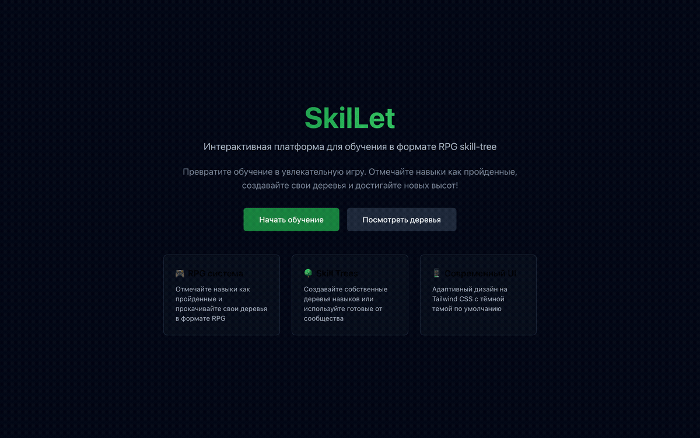
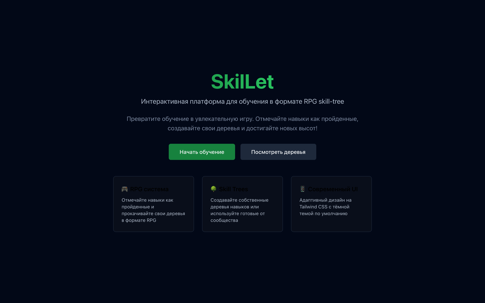
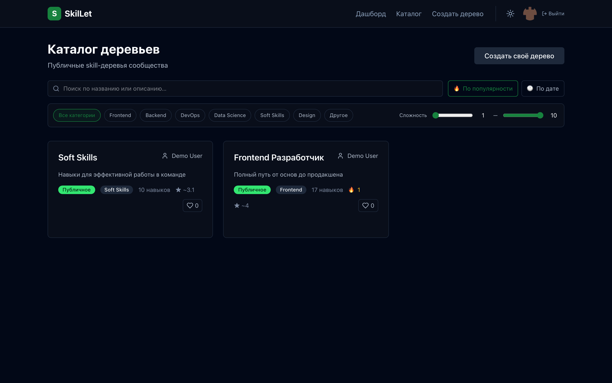
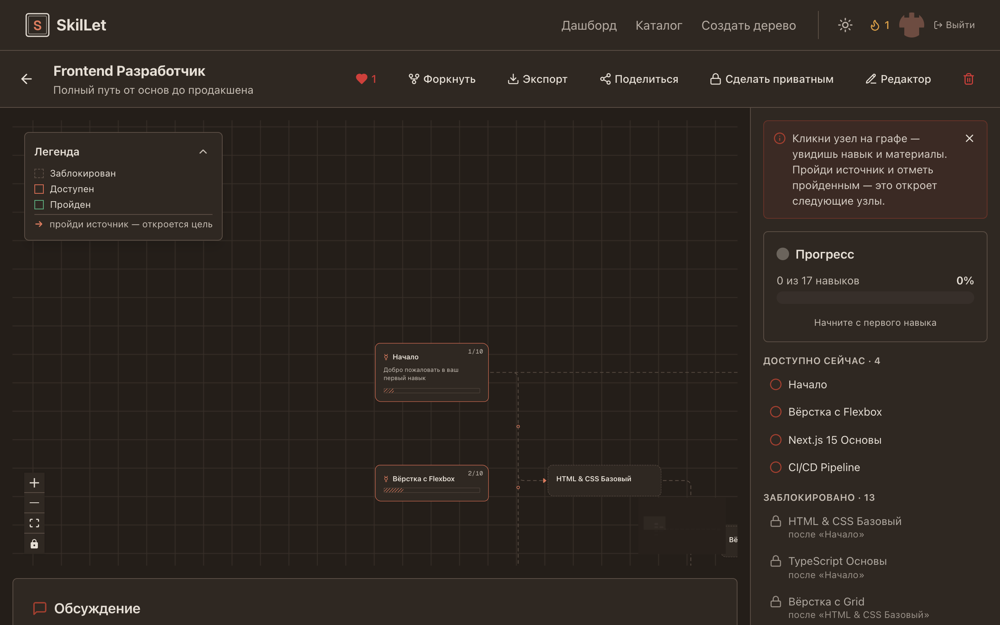
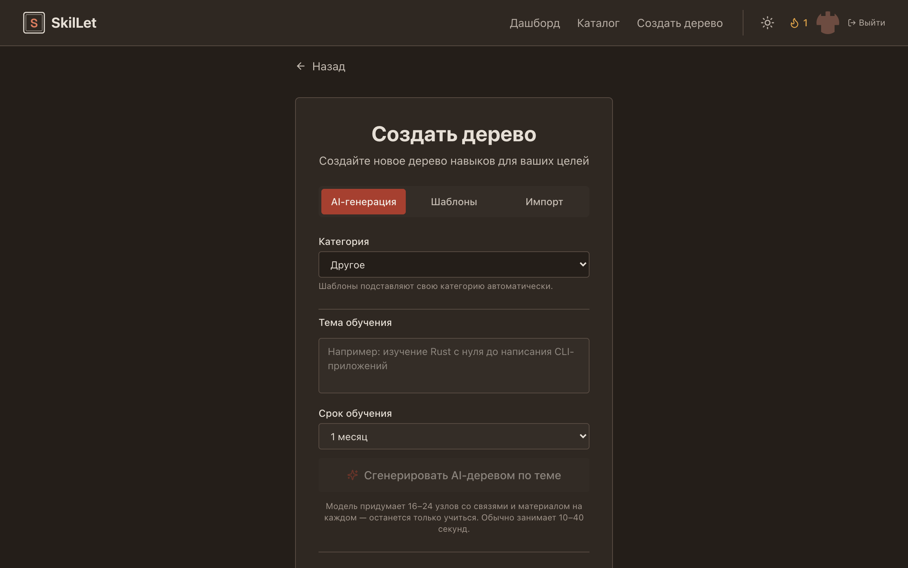
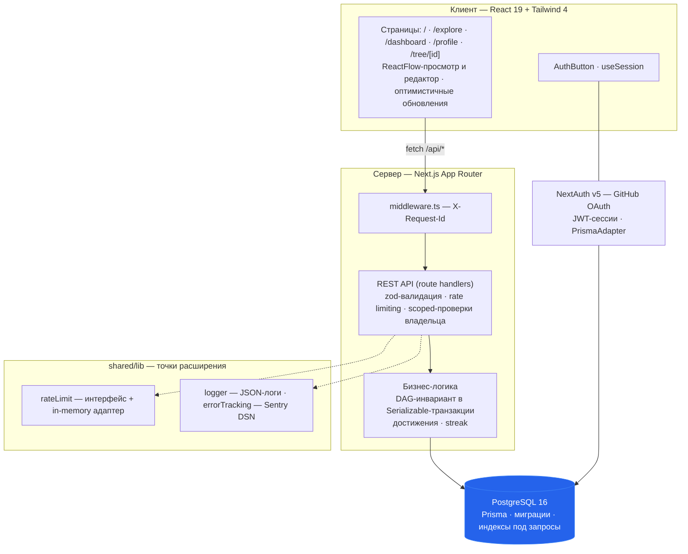

# SkilLet

<p align="left">
  <a href="https://github.com/Ilyat9/SkilLet/actions/workflows/ci.yml"></a>
  <a href="LICENSE"></a>
  
  
  
  
  = 20" />
</p>

Интерактивная платформа для обучения в формате RPG skill-tree: предметная область разбивается на узлы-навыки с зависимостями (DAG), прогресс отмечается вручную, пререквизиты разблокируются последовательно.

<p align="center">
  
</p>

## Возможности

- Skill-деревья на ReactFlow с блокировкой узлов по пререквизитам (DAG без циклов), drag & drop-редактор, панель узла (описание, сложность 1–10, ресурсы видео/статья)
- Три способа создания дерева: вручную, из шаблона (Frontend / Backend / Data Science — импорт одной транзакцией), AI-генерация по теме через OpenAI-совместимый API (без ключа фича предсказуемо недоступна)
- Экспорт дерева в JSON и импорт из файла с zod-валидацией и лимитами размера
- Сообщество: лайки (оптимистичный UI с откатом), комментарии с модерацией автором дерева, форки публичных деревьев с атрибуцией оригинала
- Каталог публичных деревьев с поиском, сортировкой по популярности/дате, фильтрами по категории и средней сложности узлов, пагинацией
- Геймификация: достижения («Первые шаги», «Дерево пройдено», «Марафонец», «Создатель», «Архитектор связей») проверяются на бэкенде при отметке прогресса; серия дней изучения (streak) с логом
- Авторизация через GitHub OAuth (NextAuth v5, JWT-сессии), полный CRUD деревьев/узлов/рёбер через REST API с zod-валидацией и scoped-проверками владельца
- Эксплуатационная база: rate limiting мутирующих роутов, health-check `/api/health`, JSON-логи с `X-Request-Id`, error tracking (Sentry-совместимый DSN), security-заголовки с построчным обоснованием CSP, graceful shutdown

## Скриншоты

| Лендинг | Каталог сообщества |
|---|---|
|  |  |

| Дерево навыков | Создание дерева |
|---|---|
|  |  |

## Технологии

| Слой | Технология |
|---|---|
| Framework | [Next.js 15](https://nextjs.org) (App Router) · React 19 |
| Язык | TypeScript 5 (strict, zero-any) |
| БД | PostgreSQL 16 · Prisma ORM 6 |
| Аутентификация | NextAuth v5 (Auth.js) + GitHub OAuth + PrismaAdapter |
| Граф | @xyflow/react (ReactFlow) |
| Стилизация | Tailwind CSS 4 · lucide-react |
| Валидация | zod |
| Тесты | vitest (unit + интеграционные на реальном Postgres) |
| CI | GitHub Actions: lint, типы, сборка, дрейф миграций, тесты |

## Архитектура

Feature-Sliced Design: зависимости направлены строго вниз, `app → widgets → features → entities → shared`. Инфраструктурные точки расширения (rate limiter, error tracking, логгер) изолированы в `shared/lib` — реализацию можно заменить, не трогая вызывающий код.



Ключевые решения:

- **DAG-инвариант**: создание ребра — `validateEdge` + вставка в одной Serializable-транзакции; гонка двух параллельных рёбер не может создать цикл. Дубликаты рёбер исключены на уровне БД (`Edge @@unique([sourceId, targetId])`)
- **JWT-сессии** вместо database-стратегии: без обращения к БД на каждый запрос, `session.user.id` заполняется колбэком
- **Индексы под реальные запросы**: каталог (`isPublic, createdAt DESC`), streak/статистика (`UserProgress(userId, completed)`), прогресс по дереву (`userId, treeId`)
- **Наблюдаемость**: каждый запрос получает `X-Request-Id`, бизнес-события логируются структурно (`tree_created`, `progress_marked`, `achievement_unlocked`), необработанные ошибки API уходят в Sentry при заданном `SENTRY_DSN`

Подробности — в [docs/ARCHITECTURE.md](docs/ARCHITECTURE.md): ER-модель, аудит авторизации, восемь осознанных архитектурных компромиссов с триггерами к переделке.

## Быстрый старт

Требования: Node.js ≥ 20, npm ≥ 10, PostgreSQL (локально или managed).

1. GitHub OAuth App: Settings → Developer settings → OAuth Apps → New. Homepage — `http://localhost:3000`, callback — `http://localhost:3000/api/auth/callback/github`
2. Склонировать и настроить окружение:

```bash
git clone https://github.com/Ilyat9/SkilLet.git
cd SkilLet
npm ci
cp .env.example .env   # заполните AUTH_SECRET, AUTH_GITHUB_ID, AUTH_GITHUB_SECRET, DATABASE_URL
```

3. Миграции и сиды:

```bash
npm run db:migrate     # prisma migrate dev
npm run db:seed        # шаблоны достижений + демо-данные
```

4. Запуск:

```bash
npm run dev            # http://localhost:3000
```

Без GitHub OAuth-ключей вход работать не будет; остальные публичные страницы — будут.

### Docker

```bash
docker-compose up --build -d   # postgres + one-off миграции + приложение
```

Прод-деплой (Docker + Neon, Vercel), rollback, ротация секретов, бэкапы, мониторинг — в [docs/DEPLOYMENT.md](docs/DEPLOYMENT.md).

## Скрипты

| Команда | Действие |
|---|---|
| `npm run dev` | dev-сервер Next.js |
| `npm run build` / `npm start` | прод-сборка (standalone) и запуск |
| `npm run lint` / `npm run format` | ESLint / Prettier |
| `npm run test` | vitest: unit + интеграционные |
| `npm run db:migrate` / `npm run db:deploy` | миграции: dev / прод |
| `npm run db:seed` / `npm run db:studio` | сиды / Prisma Studio |

## Тестирование

```bash
npm run test
```

- **Unit**: DAG-валидация, zod-схемы, node helpers, геймификация
- **Интеграционные**: REST API против реального Postgres (`TEST_DATABASE_URL`, миграции накатывает globalSetup), smoke-сценарий пользовательского пути
- **CI**: job `quality` (prisma validate, проверка дрейфа миграций против shadow-БД, tsc, eslint, build) + job `integration` (vitest на service-контейнере postgres:16)

## Переменные окружения

| Переменная | Обязательна | Назначение |
|---|---|---|
| `DATABASE_URL` | да | строка подключения Postgres |
| `AUTH_SECRET` | да | ключ подписи JWT-сессий (`openssl rand -base64 32`) |
| `AUTH_GITHUB_ID` / `AUTH_GITHUB_SECRET` | да | OAuth App GitHub |
| `NEXTAUTH_URL` | да | базовый URL приложения |
| `OPENAI_API_KEY` / `OPENAI_MODEL` / `OPENAI_BASE_URL` | нет | AI-генерация деревьев; без ключа — 503 с подсказкой |
| `SENTRY_DSN` | нет | трекинг необработанных ошибок API |

Полный список с пояснениями — в [.env.example](.env.example).

## Структура проекта

```
src/
├── app/                  # маршруты и точки входа
│   ├── api/              #   REST API-роуты (route handlers)
│   └── dashboard | explore | profile | tree/  # страницы
├── entities/             # сущности домена: Node, Tree, User (модели, zod-схемы, UI)
├── features/             # сценарии: tree-builder, achievements, progress-tracker, auth
├── widgets/              # крупные композиции: SkillTreePage, SkillTreeViewer, ProgressSidebar
├── shared/
│   ├── lib/              # prisma, auth, rateLimit, dag, logger, errorTracking, requestId
│   ├── constants/        # статусы узлов, шаблоны, лимиты
│   └── ui/               # Button, Modal, Toast и т.п.
├── middleware.ts         # X-Request-Id для каждого запроса
├── instrumentation.ts    # graceful shutdown (SIGTERM → prisma.$disconnect)
└── tests/                # интеграционные тесты API, helpers, setup
prisma/                   # schema.prisma, migrations/, seed.ts
docs/                     # ARCHITECTURE.md, DEPLOYMENT.md
```

## Масштабирование

Проект рассчитан на малую/среднюю нагрузку. Выдержит рост в 10 раз без изменений кода, кроме одного места: in-memory rate limiter при >1 инстанса (заменяется на Redis-реализацию через готовый интерфейс `RateLimiter` в `shared/lib/rateLimit.ts`). Остальные компромиссы (кэш-слой, денормализация счётчика лайков, dual-secret для ротации `AUTH_SECRET`) задокументированы с триггерами к переделке — см. [docs/ARCHITECTURE.md](docs/ARCHITECTURE.md), раздел «Архитектурные компромиссы».

## Документация

- [docs/ARCHITECTURE.md](docs/ARCHITECTURE.md) — FSD-структура, ER-модель, поток авторизации, архитектурные компромиссы
- [docs/DEPLOYMENT.md](docs/DEPLOYMENT.md) — деплой (Docker/Vercel), миграции, rollback, ротация секретов, мониторинг, бэкапы

## Участие в разработке

1. Форкните репозиторий и создайте ветку `feature/<имя>`
2. Соблюдайте конвенции проекта: TypeScript strict, zero-any, границы server/client, FSD-направление зависимостей
3. Убедитесь, что проходят `npm run lint`, `npx tsc --noEmit` и `npm run test`
4. Откройте Pull Request — CI проверит типы, линт, сборку, дрейф миграций и тесты

## Лицензия

[MIT](LICENSE)

## Автор

[Илья](https://github.com/Ilyat9) · [Telegram](https://t.me/NeIlyat9) · afrom205@gmail.com

Вопросы и предложения — через [Issues](https://github.com/Ilyat9/SkilLet/issues/new).
